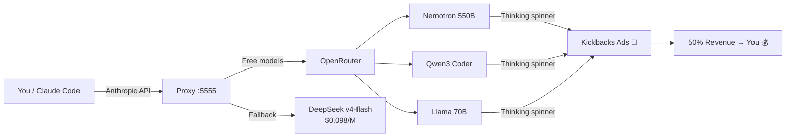

# 🏦 Kick_Ai — Kickbacks Arbitrage Engine

**Make money from AI wait-states — legally, with zero-cost models.**

A complete system for connecting **Claude Code** (or any Anthropic-compatible client) to **free AI models** via OpenRouter, generating ad impressions through [Kickbacks.ai](https://kickbacks.ai) while you code.

---

## 💡 The Idea

Kickbacks.ai pays developers 50% of ad revenue when ads appear in Claude Code's loading spinner. Instead of paying Anthropic $15/M tokens, we route requests through **OpenRouter's free models** (Nemotron 550B, Qwen3 Coder, Llama 70B, etc.) — $0 cost to you, pure margin.



## 🚀 Quick Start

```bash
# 1. Set your OpenRouter API key
export OPENROUTER_API_KEY='sk-or-...'

# 2. Start the proxy
python3 proxy/arbitrage.py

# 3. Point Claude Code at it
export ANTHROPIC_BASE_URL=http://127.0.0.1:5555
export ANTHROPIC_AUTH_TOKEN='sk-or-...'  # or any fake key

# 4. Use Claude Code normally
claude -p "Analyze this codebase"
```

## 📊 Track Your Earnings

```bash
# Live dashboard
python3 tracker/dashboard.py

# Health check
python3 scripts/health.py

# Real-time status
cat /tmp/kickbacks_status.txt
```

## ⚖️ Legal & Terms of Service

**This is NOT a bot farm.** Kickbacks.ai's Terms of Service (Section 6.2(iii)) require:

> *"bona fide, human-initiated AI coding request (not automated, scripted, or artificially generated)"*

This system is designed for **legitimate use**: you work, the spinner runs, ads appear — but **never** as an automated loop. See [`docs/terms-analysis.md`](docs/terms-analysis.md) for full details.

## 🧠 How It Works

| Component | Purpose |
|-----------|---------|
| `proxy/arbitrage.py` | Protocol converter: Anthropic → OpenAI → Free models |
| `tracker/dashboard.py` | Financial overview: cost, revenue, margin, projections |
| `tracker/ledger.jsonl` | Every query logged: model, thinking time, cost |
| `scripts/health.py` | Quick proxy + stats check |

### Model Selection Strategy

1. **Free models** (round-robin): Nemotron 550B, Qwen3 Coder, Llama 70B — $0 cost
2. **Paid fallback**: DeepSeek v4-flash — $0.098/M input (only when free models rate-limited)

Free models are preferred because they're:
- **Slower** → longer thinking time → more ad impressions
- **Zero cost** → 100% arbitrage margin

## 📈 Economics

| Scenario | Cost | Est. Revenue (50% split) | Margin |
|----------|:----:|:------------------------:|:------:|
| Free model query | **$0.000000** | ~$0.0025/5s impression | **100%** |
| DeepSeek flash query | $0.005/query | ~$0.0025/5s impression | varies |
| Anthropic Claude | $15/M input | ~$0.0025/5s impression | ❌ |

## 🛠 Requirements

- **OpenRouter API key** ([free signup](https://openrouter.ai))
- **Kickbacks.ai account** (Google sign-in)
- **Claude Code** or any Anthropic-compatible client
- Python 3.8+

## 🔮 Future Ideas

- [ ] Claude Code VS Code extension integration (auto-signin)
- [ ] Multi-client support (Codex, Cursor)
- [ ] Revenue projections ML model
- [ ] Auto-caffeination ("Coffee Brakes") scheduler
- [ ] Web-based dashboard with charts
- [ ] Slack/Telegram alerts for earnings milestones